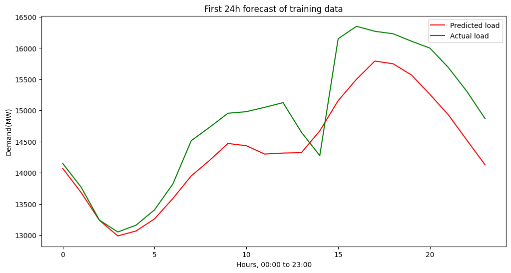
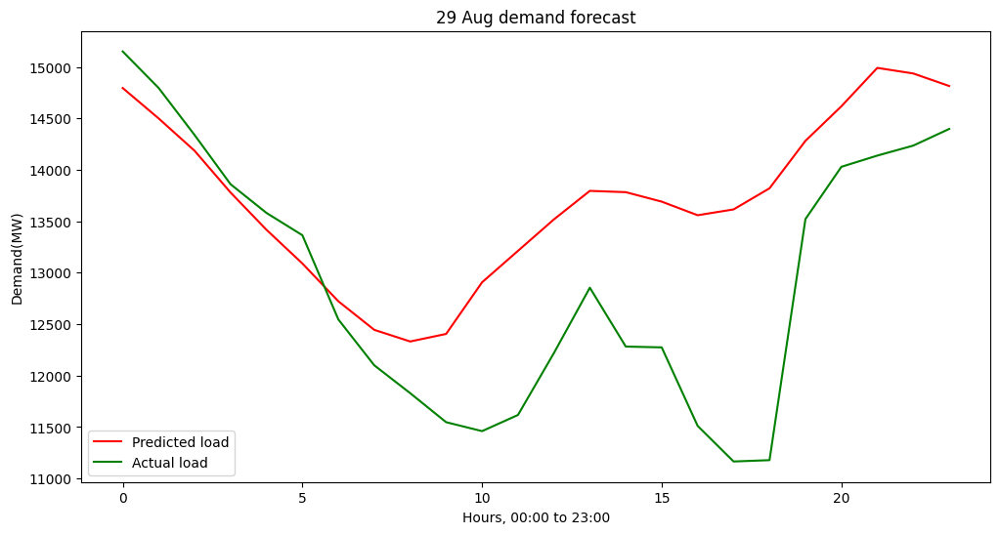
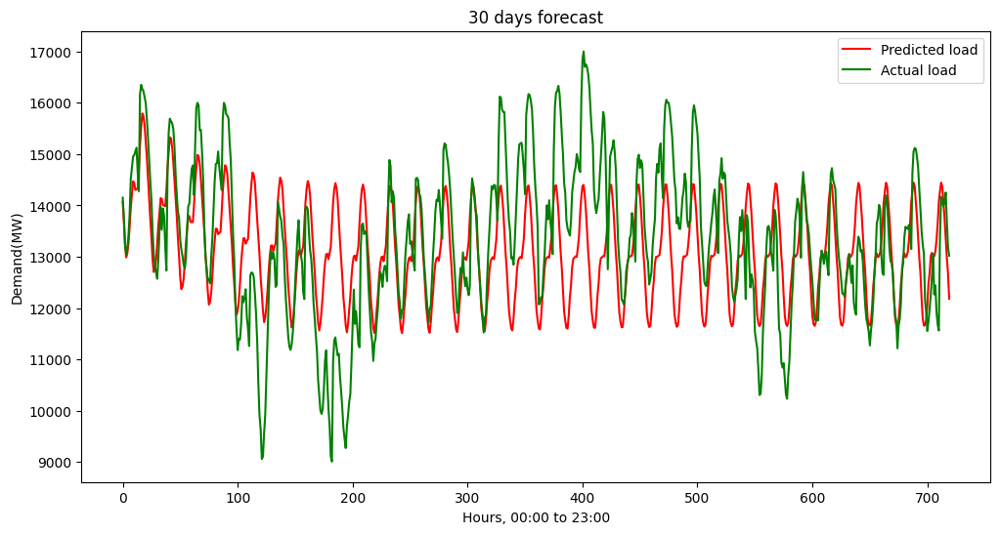

# ⚡ 24-Hour & Multi-Day Power Demand Forecasting  

This project uses **LSTM-based Seq2Seq models** to forecast short-term (next 24 hours) and long-term (30 days) electricity demand for the Bangladesh Power Grid. The model is trained on real demand data from **[Power Grid Company of Bangladesh (PGCB)](https://erp.powergrid.gov.bd/w/generations/view_generations)**.  

---

## 🔍 Overview  
- Forecast horizon: **24 hours** (single-day) and **30 days** (multi-step rolling).  
- Based on **hourly demand data** from PGCB.  
- Model: stacked **LSTM layers with dropout** and dense layers for final regression.  
- Trained using **MSE loss** with Adam optimizer and learning rate scheduling.  

---

## 🧹 Data Cleaning & Preprocessing  

The raw dataset contains timestamps and hourly demand values (`Demand(MW)`). Since the raw file is not fully clean, the following steps were applied:  

1. **Remove duplicates**  
   - Dropped any duplicate rows and duplicate timestamps.  

2. **Fix invalid dates**  
   - Parsed `Date` with a strict format (`%d-%m-%Y`), discarding invalid values.  

3. **Fix invalid times**  
   - The dataset contains times like `24:00:00` which are not supported by pandas.  
   - Converted `24:00:00` → `00:00:00` and incremented the date by one day.  
   - Padded missing leading zeros (e.g. `9:00:00` → `09:00:00`).  

4. **Create unified datetime index**  
   - Combined `Date + Time` into a single `dateTime` column.  
   - Set this as the index and resampled at **1-hour frequency**, which introduced missing slots where no data existed.  

5. **Outlier removal**  
   - Applied **IQR filtering**: values outside `[Q1 - 1.5*IQR, Q3 + 1.5*IQR]` replaced with `NaN`.  

6. **Missing value imputation**  
   - Interpolated missing and outlier-removed values using **time-based interpolation** to maintain continuity.  

7. **Scaling**  
   - Applied **MinMaxScaler (0–1)** normalization for model training.  
   - Inverse transformation is applied for plotting predictions in the original scale.  

---

## 📊 Results  

### Next 24 Hours Forecast  
Below is the model’s prediction for the next day compared to actual load data from the PGCB dataset:  

  

---

### Real Data Comparison (29 Aug 2025)  
Actual vs. predicted demand for a real day from the power grid:  

  

---

### 30 Days Forecast  
Rolling multi-step forecast for a full month, compared with test data:  

  

---

## ⚠️ Limitations  

- The model performs **very well on 24-hour forecasts**, closely tracking the real demand curve with daily seasonality captured.  
- However, when extended to a **30-day rolling forecast**, predictions tend to **flatten into a sine-like wave**, losing variability and underestimating demand peaks and troughs.  
- This limitation arises from **error accumulation in recursive predictions** and the model’s tendency to regress toward the mean over longer horizons.  

---

## 🗂 Data Source  
Electricity demand data is sourced directly from the Power Grid Company of Bangladesh (PGCB):  
🔗 [https://erp.powergrid.gov.bd/w/generations/view_generations](https://erp.powergrid.gov.bd/w/generations/view_generations)  

---

## ✨ Future Improvements  
- Add **weather and seasonal features** (temperature, holidays, weekdays/weekends).  
- Try alternative deep learning architectures like **CNN-LSTM** or **Transformers**.  
- Deploy a real-time forecasting API with live PGCB data.  
